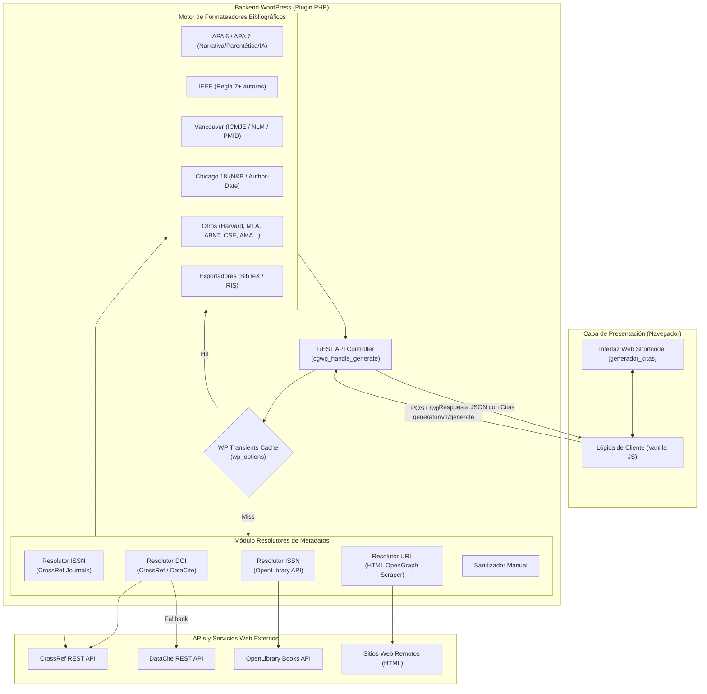
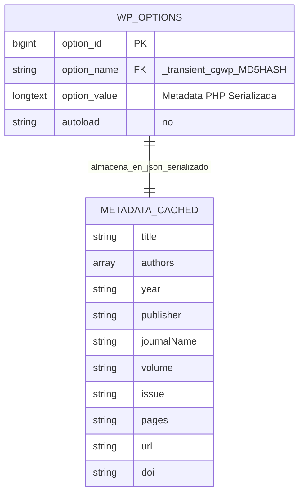
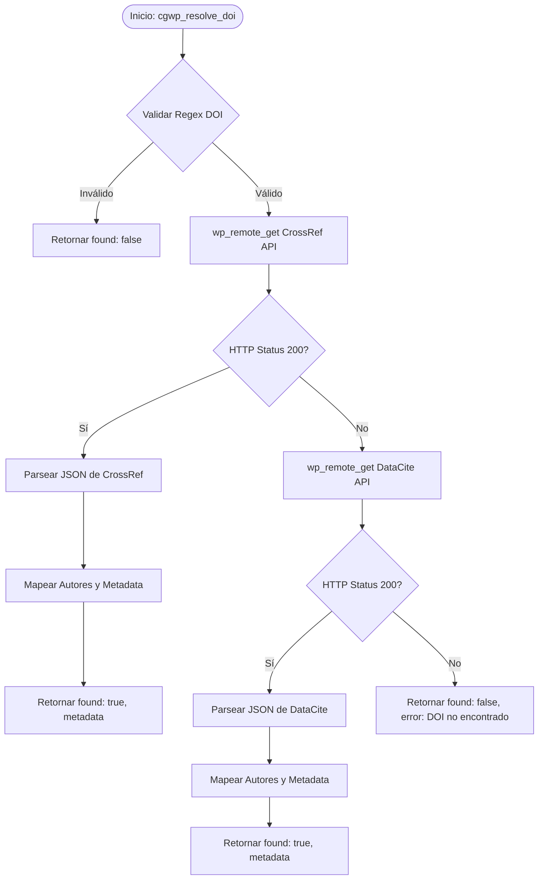
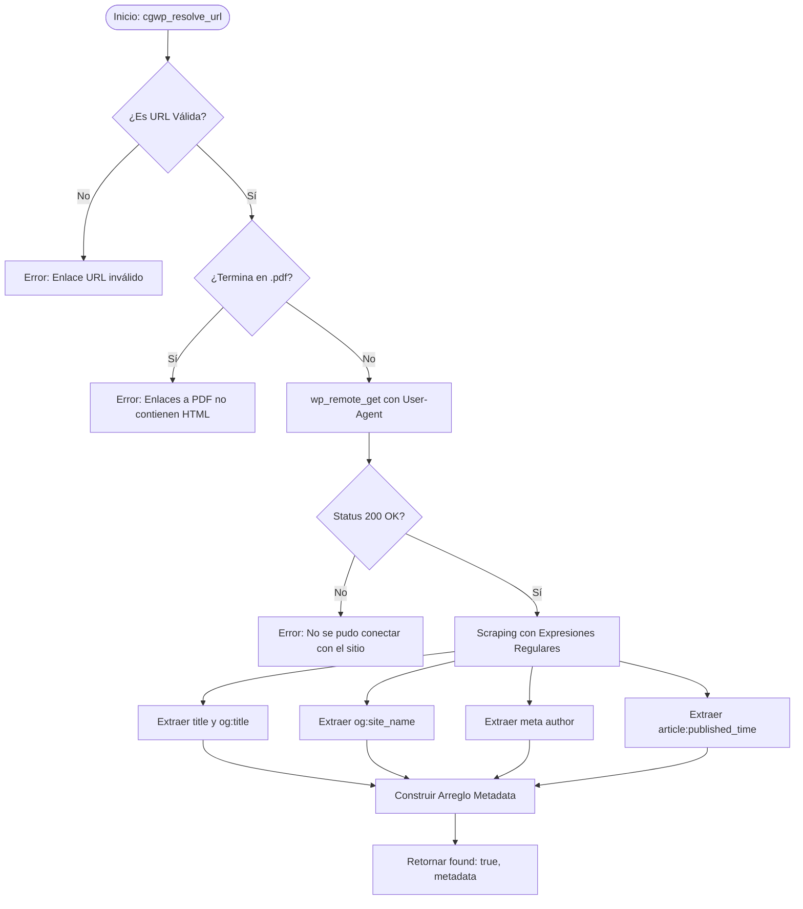
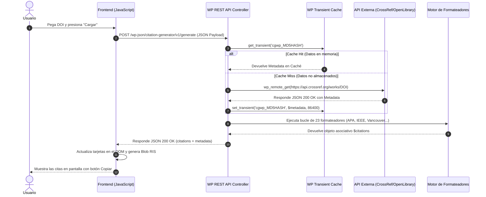

# Documentación Técnica: Generador de Citas Bibliográficas Para la Universidad Ténica de Machala

---

## Tabla de Contenidos
- [1. Portada](#1-portada)
- [2. Introducción](#2-introducción)
- [3. Arquitectura General](#3-arquitectura-general)
- [4. Flujo Completo del Sistema](#4-flujo-completo-del-sistema)
- [5. Estructura del Proyecto](#5-estructura-del-proyecto)
- [6. Dependencias](#6-dependencias)
- [7. Variables Globales y Configuración](#7-variables-globales-y-configuración)
- [8. Base de Datos y Almacenamiento](#8-base-de-datos-y-almacenamiento)
- [9. APIs y Endpoints](#9-apis-y-endpoints)
- [10. Catálogo Exhaustivo de Funciones](#10-catálogo-exhaustivo-de-funciones)
- [11. Clases y Paradigma de Programación](#11-clases-y-paradigma-de-programación)
- [12. Flujo Interno por Módulo](#12-flujo-interno-por-módulo)
- [13. Algoritmos Relevantes](#13-algoritmos-relevantes)
- [14. Validaciones del Sistema](#14-validaciones-del-sistema)
- [15. Manejo de Errores y Excepciones](#15-manejo-de-errores-y-excepciones)
- [16. Auditoría de Seguridad](#16-auditoría-de-seguridad)
- [17. Análisis de Rendimiento](#17-análisis-de-rendimiento)
- [18. Diagrama de Secuencia](#18-diagrama-de-secuencia)
- [19. Resumen del Flujo Completo](#19-resumen-del-flujo-completo)
- [20. Auditoría y Posibles Mejoras](#20-auditoría-y-posibles-mejoras)
- [21. Conclusiones](#21-conclusiones)

---

## 1. Portada

| Parámetro | Detalle |
| :--- | :--- |
| **Nombre del Proyecto** | Generador de Citas Bibliográficas Profesional (`citation-generator-wp`) |
| **Descripción** | Plugin monolítico para WordPress que permite extraer metadatos académicos y generar citas/referencias bibliográficas automáticas en múltiples estándares internacionales (APA 7, IEEE, Vancouver, Chicago 18, etc.) a partir de DOI, ISBN, ISSN, URL o entrada manual. |
| **Autor** | Anthony Lima |
| **Institución / Entidad** | Biblioteca de la Universidad Técnica de Machala (UTMACH) |
| **Sitio Web Institucional**| [https://biblioteca.utmachala.edu.ec](https://biblioteca.utmachala.edu.ec) |
| **Fecha de Documentación**| 2 de Agosto de 2026 |
| **Versión del Sistema** | `1.2.1` |
| **Licencia** | GPL-2.0-or-later |

---

## 2. Introducción

### ¿Qué hace el sistema?
El **Generador de Citas Bibliográficas Profesional** es un complemento nativo para WordPress que automatiza la creación de referencias bibliográficas y citas en texto. Permite a los usuarios ingresar identificadores únicos (DOI, ISBN, ISSN o URL de páginas web) o llenar formularios manuales estructurados. El sistema consulta APIs internacionales de metadatos académicos, procesa las reglas estilísticas de más de 15 estándares de citación y genera en tiempo real los bloques de texto formateados y archivos RIS/BibTeX descargables.

### ¿Qué problema resuelve?
En el ámbito académico y universitario, la confección manual de citas bibliográficas suele generar errores de formato (puntuación, cursivas, orden de autores, elipsis) que afectan la integridad académica de tesis e investigaciones. Además, la recopilación manual de datos desde artículos o libros resulta lenta. Este sistema elimina el margen de error humano aplicando algoritmos de formateo estrictos según las últimas ediciones normativas (ej. APA 7ª ed., Chicago 18ª ed., IEEE, Vancouver ICMJE).

### ¿Cuál es su propósito?
Proveer a la comunidad universitaria e investigadora de una herramienta web integrada, rápida y precisa para la citación de fuentes académicas y la exportación directa a gestores de referencias bibliográficas (Zotero, Mendeley, EndNote).

### ¿Para quién fue desarrollado?
Desarrollado principalmente para estudiantes, docentes e investigadores de la **Universidad Técnica de Machala (UTMACH)**, integrable en el portal de la Biblioteca General.

---

## 3. Arquitectura General

El sistema está diseñado bajo una **arquitectura monolítica modular en PHP** basada en hooks y la API REST nativa de WordPress (`WP_REST_Request` y `WP_REST_Response`).

### Capas del Sistema:
1. **Capa de Presentación (Frontend UI):** Generada mediante un shortcode (`[generador_citas]`). Construye la interfaz con componentes HTML, estilos CSS y lógica en JavaScript nativo (vanilla JS) con escucha de eventos en tiempo real.
2. **Capa de Controlador / API REST:** Expone un endpoint HTTP POST en `/wp-json/citation-generator/v1/generate` que intercepta las peticiones, gestiona la sanitización de entrada y coordina los servicios.
3. **Capa de Persistencia y Caché:** Utiliza el sistema de **Transients de WordPress** (`get_transient` / `set_transient`) para almacenar temporalmente respuestas de APIs externas en la base de datos `wp_options`.
4. **Capa de Resolutores (Extracción de Datos):** Conjunto de funciones encargadas de consumir servicios web de terceros (CrossRef, DataCite, OpenLibrary, CrossRef Journals) o procesar marcado HTML (OpenGraph / Meta tags).
5. **Capa de Formateadores Bibliográficos:** Módulo lógico que aplica las reglas normativas específicas de cada estilo bibliográfico a la estructura de datos normalizada.

### Diagrama de Arquitectura (Mermaid)



---

## 4. Flujo Completo del Sistema

1. **Entrada de Usuario:** El usuario accede a la página web donde está insertado el shortcode `[generador_citas]`.
2. **Ingreso o Detección de Identificador:**
   - Si el usuario pega un texto en la caja de búsqueda (ej. un DOI `10.1016/...` o un enlace `https://...`), la función JavaScript `cgwpHandleSearchInput()` analiza el texto mediante expresiones regulares y detecta automáticamente el tipo de fuente.
   - Alternativamente, el usuario selecciona el tipo de fuente manual (Libro, Revista, Sitio Web, IA Generativa) y llena los campos correspondientes.
3. **Petición asíncrona HTTP:** Al presionar "Cargar" o "Generar", JavaScript ejecuta una solicitud `fetch()` con un payload JSON al endpoint `/wp-json/citation-generator/v1/generate`.
4. **Recepción y Sanitización Backend:** `cgwp_handle_generate()` recibe el payload, aplica `sanitize_text_field()` o `esc_url_raw()` y calcula la clave hash MD5 (`cgwp_md5(...)`).
5. **Verificación de Caché:** Se consulta si la metadata existe en el transient de WordPress. Si existe, se salta la resolución remota.
6. **Resolución de Metadatos:**
   - Si es DOI: Consulta a `api.crossref.org/works/{doi}`. Si responde 404/Error, conmuta a `api.datacite.org/dois/{doi}`.
   - Si es ISBN: Consulta a `openlibrary.org/api/books`.
   - Si es ISSN: Consulta a `api.crossref.org/journals/{issn}`.
   - Si es URL: Realiza un GET HTTP al sitio web y parsea las etiquetas `<title>`, `<meta name="author">` y `og:title`/`og:site_name`/`article:published_time`.
   - Si es Manual: Sanitiza el arreglo de metadatos proporcionado directamente por el usuario.
7. **Normalización de Estructura:** Se genera un arreglo estandarizado con campos: `title`, `authors` (arreglo de nombres estructurados con `firstName`, `lastName`, etc.), `year`, `publisher`, `journalName`, `volume`, `issue`, `pages`, `url`, `doi`, `aiVersion`, `journalAbbrev`, `pmid`.
8. **Ejecución del Motor de Formateo:** El backend itera sobre la lista de 23 formateadores registrados (`cgwp_format_apa7`, `cgwp_format_ieee`, etc.) pasando la metadata estructurada y construye las cadenas HTML/texto de cada cita.
9. **Respuesta JSON:** Se devuelve un status HTTP 200 con el objeto conteniendo las citas generadas y la metadata limpia.
10. **Renderizado en Frontend:** El cliente JavaScript actualiza las tarjetas de resultados en el DOM, habilita el botón de copiado rápido y prepara el Blob dinámico para la descarga del archivo `.ris`.

### Diagrama de Flujo del Sistema (Mermaid)

```mermaid
flowchart TD
    A[Inicio: Usuario interactúa con la interfaz] --> B{¿Es búsqueda por Identificador o Manual?}
    
    B -->|Identificador DOI/ISBN/ISSN/URL| C[Detección automática por Regex en JS]
    B -->|Entrada Manual| D[Llenado de formulario dinámico]

    C --> E[Envío de fetch POST a REST API]
    D --> E

    E --> F[cgwp_handle_generate: Sanitización de datos]
    F --> G{¿Existe en WP Transient?}
    
    G -->|Sí (Cache Hit)| K[Normalización de Metadata]
    G -->|No (Cache Miss)| H{Tipo de Identificador}

    H -->|DOI| I1[Consulta a CrossRef API]
    I1 -->|¿Falló?| I1B[Fallback a DataCite API]
    H -->|ISBN| I2[Consulta a OpenLibrary API]
    H -->|ISSN| I3[Consulta a CrossRef Journals]
    H -->|URL| I4[Scraping de HTML / Meta Tags]
    H -->|Manual| I5[cgwp_sanitize_manual_metadata]

    I1 --> K
    I1B --> K
    I2 --> K
    I3 --> K
    I4 --> K
    I5 --> K

    K --> L[Guardar Transient en DB por 24h]
    L --> M[Bucle de Formateadores Bibliográficos]
    M --> N[Generar APA 7, IEEE, Vancouver, Chicago 18, RIS, BibTeX...]
    N --> O[Respuesta JSON 200 OK]
    O --> P[JS actualiza el DOM de resultados]
    P --> Q[Fin: Usuario copia cita o descarga RIS]
```

---

## 5. Estructura del Proyecto

El proyecto está concebido como un plugin monolítico de archivo único para maximizar la facilidad de instalación en entornos WordPress.

```
generador_citas/
 ├── citation-generator-wp.php    # Código fuente principal del plugin (Backend + API + UI + JS + CSS)
 └── Readme.md                    # Documentación técnica exhaustiva del sistema
```

### Descripción de Componentes en `citation-generator-wp.php`:
* **Líneas 1 - 25:** Encabezado oficial del plugin de WordPress y protección contra acceso directo mediante `ABSPATH`.
* **Líneas 27 - 154:** **Módulo 1: API REST.** Registro de rutas HTTP y controlador de solicitudes `cgwp_handle_generate()`.
* **Líneas 155 - 510:** **Módulo 2: Resolutores de Metadatos.** Integración de APIs de CrossRef, DataCite, OpenLibrary y parser HTML para URLs.
* **Líneas 511 - 584:** **Módulo 3: Utilidades e Internacionalización.** Helper i18n (`cgwp_t`) y formateador de nombres de autor (`cgwp_get_full_author_name`).
* **Líneas 585 - 2002:** **Módulo 4: Motor de Formateadores.** Implementación de 23 funciones independientes para cada estándar de citación.
* **Líneas 2003 - 3179:** **Módulo 5: Interfaz de Usuario y Shortcode.** Generación de marcado HTML, hojas de estilo CSS inline y scripts de interacción en JavaScript vanilla.

---

## 6. Dependencias

### 1. Dependencias del Entorno Servidor
* **PHP 7.4 o superior:** Utiliza funciones avanzadas de manipulación de cadenas de texto multibyte (`mb_substr`), JSON y tipos de datos estrictos.
* **WordPress Core (5.0+):** Requiere las APIs nativas de WordPress:
  * `WP_REST_Request` / `WP_REST_Response`
  * `wp_remote_get()` / `wp_remote_retrieve_body()` / `wp_remote_retrieve_response_code()`
  * `get_transient()` / `set_transient()`
  * `sanitize_text_field()` / `esc_url_raw()`
  * `add_action()` / `add_shortcode()`

### 2. APIs y Servicios Web Externos

| Servicio / API | Endpoint Base | Propósito | Ventajas / Razones de uso |
| :--- | :--- | :--- | :--- |
| **CrossRef REST API** | `https://api.crossref.org/works/` | Extracción de metadatos bibliográficos de artículos científicos mediante DOI. | Es el registro primario de DOIs para literatura académica a nivel mundial. |
| **DataCite REST API** | `https://api.datacite.org/dois/` | Fallback para resolución de DOIs científicos y de conjuntos de datos. | Permite resolver DOIs que no están registrados en CrossRef. |
| **OpenLibrary API** | `https://openlibrary.org/api/books` | Recuperación de metadatos de libros impresos y digitales vía ISBN. | Base de datos libre, gratuita y sin requerimiento de API Key privada. |
| **CrossRef Journals** | `https://api.crossref.org/journals/` | Validación de ISSN e identificación de títulos de revistas. | Permite autocompletar el nombre oficial de la revista según su ISSN. |

---

## 7. Variables Globales y Configuración

El proyecto evita contaminar el espacio de nombres global en PHP mediante el prefijo `cgwp_` en todas sus funciones y claves.

### Claves y Configuraciones del Sistema:

| Variable / Clave | Ámbito | Descripción |
| :--- | :--- | :--- |
| `ABSPATH` | Constante WP | Constante nativa de WordPress utilizada para impedir la ejecución directa del script por HTTP. |
| `$cache_key` | PHP Local (Controller) | Clave única de transient generada dinámicamente: `'cgwp_' . md5( $type . '_' . $value )`. |
| `DAY_IN_SECONDS` | Constante WP | Define el tiempo de vida (TTL) del transient de memoria caché (86,400 segundos = 24 horas). |
| `CGWP_CARD_KEYS` | JavaScript Global | Arreglo JS con las claves de las tarjetas de resultados a actualizar en el DOM: `['apa7', 'apa7_narrative', 'ieee', 'vancouver', ...]` |
| `cgwpAuthorCount` | JavaScript Global | Contador entero utilizado para asignar IDs únicos a las filas dinámicas de autores en el formulario manual. |
| `cgwpCurrentRis` | JavaScript Global | Variable de estado JS que almacena el contenido en texto plano de la cita en formato `.ris` lista para descarga. |

---

## 8. Base de Datos y Almacenamiento

El plugin **no crea tablas personalizadas** en la base de datos de MySQL/MariaDB, lo que garantiza una instalación y desinstalación limpia sin dejar residuos.

### Uso del Almacenamiento de Transients:
Utiliza la tabla estándar `wp_options` a través de la API de **Transients de WordPress**.

* **Nombre del campo en `wp_options`:** `_transient_cgwp_{hash_md5}` y `_transient_timeout_cgwp_{hash_md5}`.
* **Estructura almacenada:** Arreglo asociativo PHP serializado con los metadatos resueltos.
* **Estrategia de limpieza:** Expiración automática gestionada por el motor de transients de WordPress tras 24 horas (`DAY_IN_SECONDS`).

### Diagrama Entidad-Relación de Persistencia (Mermaid ER)



---

## 9. APIs y Endpoints

### Endpoint Principal de Generación

#### `POST /wp-json/citation-generator/v1/generate`

* **URL:** `http://tusitio.com/wp-json/citation-generator/v1/generate`
* **Método HTTP:** `POST`
* **Permisos:** Público (`'permission_callback' => '__return_true'`)
* **Headers requeridos:** `Content-Type: application/json`

#### Parámetros del Body (JSON):

| Campo | Tipo | Requerido | Descripción / Valores permitidos |
| :--- | :--- | :--- | :--- |
| `type` | String | Sí | Tipo de consulta: `'doi'`, `'isbn'`, `'issn'`, `'url'`, `'manual'`. |
| `value` | String | Sí (salvo manual) | Cadena con el identificador (ej: `'10.1016/j.cell.2023.01.001'`). |
| `lang` | String | No | Idioma de la cita: `'es'` (predeterminado) o `'en'`. |
| `sourceType`| String | No | Tipo de fuente: `'journal_article'`, `'book'`, `'website'`, `'ai_generative'`, etc. |
| `metadata` | Object | Solo en `manual` | Objeto JSON con los campos de metadatos ingresados manualmente. |

#### Ejemplo de Solicitud (Payload JSON):

```json
{
  "type": "doi",
  "value": "10.1038/s41586-020-2649-2",
  "lang": "es",
  "sourceType": "journal_article"
}
```

#### Ejemplo de Respuesta Exitosa (200 OK):

```json
{
  "success": true,
  "citations": {
    "apa7": "Author, A. (2020). Title of the article. <i>Nature</i>, <i>584</i>(7820), 100-105. https://doi.org/10.1038/s41586-020-2649-2",
    "apa7_narrative": "Author (2020)",
    "ieee": "[1] A. Author, \"Title of the article,\" <i>Nature</i>, vol. 584, no. 7820, pp. 100-105, 2020.",
    "vancouver": "Author A. Title of the article. Nature. 2020;584(7820):100-105.",
    "ris": "TY  - JOUR\nTI  - Title of the article\nAU  - Author, A.\nPY  - 2020\nJO  - Nature\nVL  - 584\nIS  - 7820\nSP  - 100\nEP  - 105\nUR  - https://doi.org/10.1038/s41586-020-2649-2\nER  - \n"
  },
  "metadata": {
    "authors": [
      {
        "firstName": "A.",
        "middleName": "",
        "lastName": "Author",
        "secondLastName": "",
        "isCorporate": false
      }
    ],
    "title": "Title of the article",
    "year": "2020",
    "doi": "10.1038/s41586-020-2649-2",
    "journalName": "Nature",
    "volume": "584",
    "issue": "7820",
    "pages": "100-105",
    "url": "https://doi.org/10.1038/s41586-020-2649-2",
    "lang": "es",
    "sourceType": "journal_article"
  }
}
```

#### Respuestas de Error:

* **HTTP 400 Bad Request:** Identificador no proporcionado.
  ```json
  { "success": false, "error": "El identificador es requerido." }
  ```
* **HTTP 404 Not Found:** Identificador no encontrado en APIs externas.
  ```json
  { "success": false, "error": "DOI no encontrado." }
  ```

---

## 10. Catálogo Exhaustivo de Funciones

A continuación se documentan **todas** las 33 funciones PHP presentes en el archivo [citation-generator-wp.php](file:///c:/Users/antho/Septimo%20Semestre/generador_citas/citation-generator-wp.php):

### 1. `cgwp_register_routes()`
* **Propósito:** Registra las rutas de la REST API en el hook `rest_api_init`.
* **Parámetros:** Ninguno.
* **Retorno:** `void`.
* **Flujo Interno:** Ejecuta `register_rest_route()` asociando el callback `cgwp_handle_generate`.

### 2. `cgwp_handle_generate( WP_REST_Request $request )`
* **Propósito:** Controlador principal que recibe las solicitudes REST API, consulta la caché en Transients, delega la búsqueda a los resolutores y llama al motor de formateadores.
* **Parámetros:** `$request` (`WP_REST_Request`): Objeto de solicitud REST de WordPress.
* **Retorno:** `WP_REST_Response` (Objeto JSON con código HTTP 200, 400 o 404).

### 3. `cgwp_resolve_doi( $doi )`
* **Propósito:** Resuelve un identificador DOI consultando CrossRef API con fallback a DataCite.
* **Parámetros:** `$doi` (String): Cadena del DOI.
* **Retorno:** Array `array('found' => bool, 'metadata' => array, 'error' => string|null)`.

### 4. `cgwp_resolve_isbn( $isbn )`
* **Propósito:** Extrae metadatos de un libro mediante la API de OpenLibrary usando el ISBN.
* **Parámetros:** `$isbn` (String): Número ISBN (10 o 13 dígitos).
* **Retorno:** Array `array('found' => bool, 'metadata' => array)`.

### 5. `cgwp_resolve_issn( $issn )`
* **Propósito:** Valida un ISSN e identifica el título de la revista y editorial en CrossRef Journals.
* **Parámetros:** `$issn` (String): Código ISSN (`XXXX-XXXX`).
* **Retorno:** Array `array('found' => bool, 'metadata' => array, 'error' => string|null)`.

### 6. `cgwp_resolve_url( $url )`
* **Propósito:** Efectúa web scraping en una página web mediante HTTP GET para extraer meta-etiquetas HTML (OpenGraph / Author / Title). Rechaza enlaces directos a archivos PDF.
* **Parámetros:** `$url` (String): Enlace web completo.
* **Retorno:** Array `array('found' => bool, 'metadata' => array, 'error' => string|null)`.

### 7. `cgwp_sanitize_manual_metadata( $meta )`
* **Propósito:** Sanitiza y limpia el arreglo de metadatos proporcionado manualmente por el usuario.
* **Parámetros:** `$meta` (Array): Arreglo asociativo de datos sin procesar.
* **Retorno:** Array: Arreglo asociativo sanitizado con `sanitize_text_field` y `esc_url_raw`.

### 8. `cgwp_t( $key, $lang = 'es' )`
* **Propósito:** Helper de internacionalización (i18n) para traducir conectores bibliográficos (*"y"*, *"En"*, *"ed."*, *"s.f."*).
* **Parámetros:** `$key` (String), `$lang` (String, opcional, default `'es'`).
* **Retorno:** String: Término traducido.

### 9. `cgwp_get_full_author_name( $author, $format = 'last-first' )`
* **Propósito:** Formatea un objeto de autor individual o corporativo según el estándar solicitado (`last-first`, `first-last`, `last-init`, `init-last`, `last-only`).
* **Parámetros:** `$author` (Array), `$format` (String).
* **Retorno:** String: Cadena formateada del nombre de autor.

### 10. `cgwp_format_apa6( $metadata )`
* **Propósito:** Genera la cita completa en formato APA 6ª Edición.
* **Parámetros:** `$metadata` (Array).
* **Retorno:** String (HTML con cursivas).

### 11. `cgwp_format_apa7( $metadata )`
* **Propósito:** Genera la referencia bibliográfica completa en formato APA 7ª Edición (aplica elipsis `. . .` para 21+ autores y soporte para IA Generativa).
* **Parámetros:** `$metadata` (Array).
* **Retorno:** String (HTML).

### 12. `cgwp_format_apa7_narrative( $metadata )`
* **Propósito:** Genera la cita narrativa en texto en formato APA 7 (`Autor (Año)`).
* **Parámetros:** `$metadata` (Array).
* **Retorno:** String.

### 13. `cgwp_format_apa7_parenthetical( $metadata )`
* **Propósito:** Genera la cita parentética en texto en formato APA 7 (`(Autor, Año)`).
* **Parámetros:** `$metadata` (Array).
* **Retorno:** String.

### 14. `cgwp_format_harvard( $metadata )`
* **Propósito:** Genera la cita bibliográfica en estilo Harvard.
* **Parámetros:** `$metadata` (Array).
* **Retorno:** String (HTML).

### 15. `cgwp_format_chicago( $metadata )`
* **Propósito:** Alias de compatibilidad que invoca a `cgwp_format_chicago_bibliography`.
* **Parámetros:** `$metadata` (Array).
* **Retorno:** String (HTML).

### 16. `cgwp_format_chicago_bibliography( $metadata )`
* **Propósito:** Genera la entrada bibliográfica del sistema Chicago 18ª ed. (Notes & Bibliography).
* **Parámetros:** `$metadata` (Array).
* **Retorno:** String (HTML).

### 17. `cgwp_format_chicago_note_full( $metadata )`
* **Propósito:** Genera la nota a pie de página completa en Chicago 18ª ed. (Notes & Bibliography).
* **Parámetros:** `$metadata` (Array).
* **Retorno:** String (HTML).

### 18. `cgwp_format_chicago_note_short( $metadata )`
* **Propósito:** Genera la nota a pie de página abreviada en Chicago 18ª ed.
* **Parámetros:** `$metadata` (Array).
* **Retorno:** String.

### 19. `cgwp_format_chicago_authordate_intext( $metadata )`
* **Propósito:** Genera la cita en texto del sistema Chicago 18ª ed. (Author-Date).
* **Parámetros:** `$metadata` (Array).
* **Retorno:** String.

### 20. `cgwp_format_chicago_authordate_reference( $metadata )`
* **Propósito:** Genera la referencia bibliográfica del sistema Chicago 18ª ed. (Author-Date).
* **Parámetros:** `$metadata` (Array).
* **Retorno:** String (HTML).

### 21. `cgwp_format_turabian( $metadata )`
* **Propósito:** Genera la cita bibliográfica en estilo Turabian.
* **Parámetros:** `$metadata` (Array).
* **Retorno:** String (HTML).

### 22. `cgwp_format_ieee( $metadata )`
* **Propósito:** Genera la cita bibliográfica en estilo IEEE (aplica truncamiento *"Primero et al."* para 7+ autores).
* **Parámetros:** `$metadata` (Array).
* **Retorno:** String (HTML).

### 23. `cgwp_format_vancouver( $metadata )`
* **Propósito:** Genera la cita en formato Vancouver (con normas ICMJE, abreviatura NLM y PMID).
* **Parámetros:** `$metadata` (Array).
* **Retorno:** String.

### 24. `cgwp_format_abnt( $metadata )`
* **Propósito:** Genera la cita en formato ABNT (Asociação Brasileira de Normas Técnicas).
* **Parámetros:** `$metadata` (Array).
* **Retorno:** String (HTML).

### 25. `cgwp_format_cse( $metadata )`
* **Propósito:** Genera la cita en formato CSE (Council of Science Editors).
* **Parámetros:** `$metadata` (Array).
* **Retorno:** String (HTML).

### 26. `cgwp_format_asa( $metadata )`
* **Propósito:** Genera la cita en formato ASA (American Sociological Association).
* **Parámetros:** `$metadata` (Array).
* **Retorno:** String (HTML).

### 27. `cgwp_format_apsa( $metadata )`
* **Propósito:** Genera la cita en formato APSA (American Political Science Association).
* **Parámetros:** `$metadata` (Array).
* **Retorno:** String (HTML).

### 28. `cgwp_format_aaa( $metadata )`
* **Propósito:** Genera la cita en formato AAA (American Anthropological Association).
* **Parámetros:** `$metadata` (Array).
* **Retorno:** String (HTML).

### 29. `cgwp_format_ama( $metadata )`
* **Propósito:** Genera la cita en formato AMA (American Medical Association).
* **Parámetros:** `$metadata` (Array).
* **Retorno:** String (HTML).

### 30. `cgwp_format_mla( $metadata )`
* **Propósito:** Genera la cita en formato MLA (Modern Language Association).
* **Parámetros:** `$metadata` (Array).
* **Retorno:** String (HTML).

### 31. `cgwp_format_bibtex( $metadata )`
* **Propósito:** Genera la representación en formato de sintaxis BibTeX (`@article`, `@book`, `@misc`).
* **Parámetros:** `$metadata` (Array).
* **Retorno:** String (Texto plano formateado).

### 32. `cgwp_format_ris( $metadata )`
* **Propósito:** Genera la estructura de datos en formato de intercambio RIS (`TY  - JOUR`, `AU  - ...`, `ER  - `).
* **Parámetros:** `$metadata` (Array).
* **Retorno:** String (Texto plano para archivo `.ris`).

### 33. `cgwp_render_generator_shortcode()`
* **Propósito:** Función ligada al shortcode `[generador_citas]`. Renderiza el buffer HTML, CSS y la lógica interactiva JavaScript.
* **Parámetros:** Ninguno.
* **Retorno:** String: Buffer HTML procesado mediante `ob_get_clean()`.

---

## 11. Clases y Paradigma de Programación

El plugin no define clases Orientadas a Objetos (`class`), sino que utiliza el **paradigma funcional/procedural guiado por hooks**, que es el estándar histórico y recomendado para plugins ligeros monolíticos en el ecosistema WordPress.

### Características del Paradigma Utilizado:
* **Aislamiento por Prefijos:** Todas las funciones globales utilizan el prefijo `cgwp_` para evitar colisiones en el espacio de nombres de PHP.
* **Inmutable Data Flow:** Las funciones de formateo son **funciones puras**: reciben una estructura de datos `$metadata` y devuelven una cadena de texto sin modificar el estado global del servidor.

---

## 12. Flujo Interno por Módulo

### 1. Módulo Resolutor DOI (`cgwp_resolve_doi`)



### 2. Módulo Resolutor de URLs (`cgwp_resolve_url`)



---

## 13. Algoritmos Relevantes

### 1. Algoritmo de Parseo de Nombres de Autor (`cgwp_get_full_author_name`)
El algoritmo recibe la estructura del autor y normaliza los nombres y apellidos:

1. **Evaluación Corporativa:** Si `$author['isCorporate'] === true`, devuelve directamente el nombre corporativo sin modificar (ej: *"Universidad Técnica de Machala"*).
2. **Concatenación de Nombres:** Junta `$firstName` y `$middleName` en `$full_first`.
3. **Concatenación de Apellidos:** Junta `$lastName` y `$secondLastName` en `$full_last`.
4. **Formateo de Iniciales (para estilos como APA / Vancouver):**
   * Extrae la primera letra de `$firstName` usando `mb_substr($first, 0, 1, 'UTF-8')` y le añade un punto.
   * Si existe `$middleName`, realiza la misma operación y une ambas iniciales.
5. **Ensamblado:** Retorna según la regla solicitada:
   * `'last-first'` $\rightarrow$ `"García López, Juan Carlos"`
   * `'last-init'` $\rightarrow$ `"García López, J. C."`
   * `'init-last'` $\rightarrow$ `"J. C. García López"`

### 2. Algoritmo de Elipsis para APA 7ª Edición (21+ Autores)
En APA 7, si una fuente tiene 20 o menos autores, se listan todos. Si tiene 21 o más:
1. Contar el arreglo de autores `$count = count($authors)`.
2. Si `$count <= 20`, se listan todos separados por comas y el último precedido por `&` (o `y`).
3. Si `$count > 20`:
   * Se toman los primeros 19 autores: `array_slice($authors_list, 0, 19)`.
   * Se unen con comas.
   * Se inserta una elipsis espaciada: ` . . . `.
   * Se añade únicamente el último autor de la lista (`$authors_list[$count - 1]`).

### 3. Algoritmo de Truncamiento para IEEE (7+ Autores)
1. Contar los autores en la lista `$count = count($authors)`.
2. Si `$count >= 7`, toma únicamente el primer autor formateado (`$authors_list[0]`) y le concatena la locución latina `" et al."`.

---

## 14. Validaciones del Sistema

| Tipo de Entrada | Regla / Validación aplicada | Acción si falla |
| :--- | :--- | :--- |
| **DOI** | Regex: `/(10\.\d{4,9}\/[-._;()\/:\w]+)/` | Retorna error HTTP 404: *"Formato de DOI inválido."* |
| **ISBN** | Limpieza de caracteres no alfanuméricos: `preg_replace('/[^0-9X]/i', '', $isbn)` | Retorna error HTTP 404: *"ISBN no encontrado."* |
| **ISSN** | Formateo estricto a 8 caracteres numéricos con guion central: `^\d{4}-\d{3}[\dXx]$` | Retorna error: *"El formato del ISSN debe ser XXXX-XXXX."* |
| **URL (General)** | Validación nativa de PHP: `filter_var($url, FILTER_VALIDATE_URL)` | Retorna error: *"Enlace URL inválido."* |
| **URL (Archivos PDF)** | Detección de extensión `.pdf`: `preg_match('/\.pdf$/i', $url)` | Rechaza el scraping indicando que use DOI o entrada manual. |
| **Campos Manuales** | Verificación de obligatoriedad en título y año en JS. | Marca los bordes en rojo en el formulario y detiene la petición. |
| **IA Generativa** | Validación de autoría corporativa obligatoria (Compañía desarrolladora). | Exige el nombre de la compañía (ej: OpenAI). |

---

## 15. Manejo de Errores y Excepciones

El sistema utiliza un enfoque de **respuestas de error controladas** evitando que el servidor lance excepciones sin capturar (*fatal errors*).

### Estrategias de Manejo:
1. **Control de Errores HTTP en `wp_remote_get`:**
   ```php
   if ( is_wp_error( $response ) || wp_remote_retrieve_response_code( $response ) !== 200 ) {
       return array( 'found' => false, 'error' => 'No se pudo conectar con el servicio externo.' );
   }
   ```
2. **Códigos de Estado REST API:**
   * `400 Bad Request`: Cuando faltan parámetros obligatorios.
   * `404 Not Found`: Cuando una API externa no encuentra el identificador o el servidor destino bloquea la consulta.
3. **Manejo de Timeout:** Todas las peticiones salientes a APIs externas tienen un límite de tiempo estricto de **8 segundos** (`'timeout' => 8`) para evitar el bloqueo del hilo de ejecución de PHP.

---

## 16. Auditoría de Seguridad

### Fortalezas de Seguridad Implementadas:
* **Protección contra ejecución directa:**
  ```php
  if ( ! defined( 'ABSPATH' ) ) { exit; }
  ```
* **Sanitización de entradas:**
  * Uso sistemático de `sanitize_text_field()` en todas las cadenas recibidas por la API REST.
  * Uso de `esc_url_raw()` para enlaces URL.
* **Prevención de XSS:** Salida limpia en las respuestas JSON y renderizado seguro en JS mediante asignación a `innerText` o `textContent` en las cajas de texto de citas.
* **Inyección SQL:** Imposible de realizar a través del plugin, ya que **no realiza consultas SQL directas** ni interactúa con `$wpdb`.

### Debilidades y Puntos de Atención:
* **Permiso Abierto en REST API:**
  ```php
  'permission_callback' => '__return_true'
  ```
  * **Análisis:** El endpoint es 100% público. Cualquier cliente o bot externo puede enviar peticiones POST al servidor.
  * **Riesgo:** Posible ataque de denegación de servicio (DoS) o consumo excesivo del ancho de banda del servidor por peticiones maliciosas en bucle a sitios externos.

---

## 17. Análisis de Rendimiento

### 1. Complejidad Algorítmica
* **Procesamiento de Citas:** Complejidad temporal $\mathcal{O}(N)$ donde $N$ es el número de autores. Dado que $N \le 100$ en la inmensa mayoría de publicaciones, el tiempo de ejecución de las 23 funciones de formateo en memoria PHP es despreciable ($< 5\text{ ms}$).
* **Peticiones HTTP Externas:** Es el principal cuello de botella (latencia de red entre 200ms y 1500ms al consultar CrossRef/OpenLibrary).

### 2. Estrategia de Optimización (Transients Cache)
El plugin mitiga el cuello de botella de red mediante el sistema de Transients:
* La primera consulta a un DOI (ej: `10.1038/...`) tarda ~800ms en resolver desde CrossRef.
* Las siguientes consultas al mismo DOI responden en **< 15ms** al leer los datos directamente desde la memoria caché de WordPress (`wp_options`).

---

## 18. Diagrama de Secuencia

El siguiente diagrama ilustra la secuencia completa de interacciones entre los componentes:



---

## 19. Resumen del Flujo Completo

Desde una perspectiva funcional:
1. El estudiante o investigador ingresa a la plataforma web de la Biblioteca UTMACH.
2. Introduce un identificador (DOI, ISBN, ISSN o URL) en el generador.
3. El sistema reconoce automáticamente el tipo de fuente y consulta las bases de datos bibliográficas internacionales.
4. Los datos son parseados y transformados instantáneamente a más de 15 estándares de citación académica oficial.
5. El usuario puede filtrar por disciplina (General, Medicina, Técnico, Historia) y copiar la cita deseada con un solo clic o descargar la referencia completa en formato `.ris` para importarla en su gestor bibliográfico personal.

---

## 20. Auditoría y Posibles Mejoras

Como resultado del análisis técnico del código fuente, se sugieren las siguientes mejoras para versiones futuras (`v2.0`):

### 1. Arquitectura y Mantenibilidad
* **Modularización de archivos:** Dividir el archivo monolítico `citation-generator-wp.php` en una estructura limpia de clases PHP en una carpeta `/includes`:
  * `includes/class-cgwp-rest-api.php`
  * `includes/class-cgwp-resolver-doi.php`
  * `includes/class-cgwp-formatter.php`
* **Inyección de Scripts y CSS Nativa:** En lugar de imprimir el bloque `<style>` y `<script>` dentro del shortcode, cargarlos mediante las funciones estándar `wp_enqueue_script()` y `wp_enqueue_style()`.

### 2. Seguridad y Rate Limiting
* **Verificación de Nonce:** Implementar un token CSRF (WordPress Nonce) en la API REST utilizando `wp_create_nonce('cgwp_rest_nonce')` para asegurar que las peticiones provengan exclusivamente del formulario web de la universidad.
* **Control de Frecuencia (Rate Limiting):** Limitar a un máximo de 30 peticiones por minuto por dirección IP para evitar abusos o denegaciones de servicio.

### 3. Dinamismo de URLs REST API
* Sustituir la ruta estática `/wp-json/...` en el script de JavaScript por la llamada dinámica en PHP `esc_url_raw( rest_url( 'citation-generator/v1/generate' ) )` para garantizar una compatibilidad del 100% en sitios de WordPress instalados en subdirectorios o carpetas secundarias.

---

## 21. Conclusiones

El **Generador de Citas Bibliográficas Profesional (v1.2.1)** es una solución técnica sólida, eficiente y rigurosa para la automatización de la citación académica en plataformas WordPress. Su motor de formateo cumple de forma estricta con las últimas especificaciones normativas internacionales (APA 7, IEEE, Vancouver ICMJE, Chicago 18), mientras que su integración con APIs como CrossRef y OpenLibrary ofrece una experiencia de usuario rápida y libre de errores de tipeo.

La implementación del almacenamiento en caché mediante WP Transients minimiza la latencia de red y protege los límites de tasa de las APIs externas. Al aplicar las mejoras sugeridas de modularización y verificación mediante Nonces, el sistema alcanzará un nivel óptimo de escalabilidad, seguridad y mantenibilidad a nivel empresarial.
